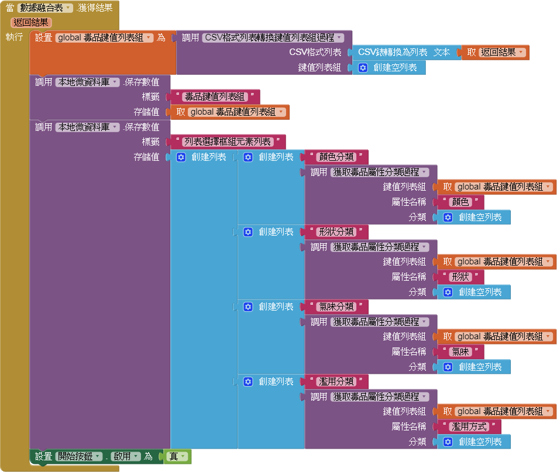

<style>
img{
  margin: 0 auto;
  display: block;
  max-width: 80%!important;
  max-height: 720px;
}
</style>

# 雲端技術輔助毒品鑑識之研究
使用 `APP Inventor 2` 設計 Android App，透過`Google Fusion Tables API` 讀取毒品資料來輔助毒品鑑識的工作。

## 伺服端設置
這裡需要Google雲端硬碟`Fusion Tables(融合表)`儲存資料，並從` Google Cloud Platform(Google雲端平台)`啟用`Fusion Tables API`。以下是伺服端的流程圖：


### Google Fusion Tables
首先將毒品原始資料進行彙整，並記錄在Google雲端硬碟中的 `Fusion Tables(融合表)`。`Fusion Tables(融合表)`是Google雲端硬碟中的是一個實驗數據可視化Web應用程序，用於收集，可視化和共享數據。融合表儲存在Google雲端硬碟，雲端硬碟的持有者，可以線上編輯融合表並能管理其他帳戶的存取權限。

在融合表新增一筆資料時，融合表會根據欄位建立一個輸入表單(Form)，所以表格欄位及其格式都必須要明確的定義，並讓資料輸入人員遵循定義的格式來建立資料。以下是`Fusion Tables(融合表)`根據毒品特徵屬性的欄位定義：
- 級別：毒品的級別，從第一級到第四級。
- 中文學名：毒品的中文正式名稱。
- 英文學名：毒品的英文正式名稱。
- 俗名：毒品常見的各種俗名，需要用英文逗號`,`分隔。
- 形狀：毒品的形狀，如結晶或錠狀，需要用英文逗號`,`分隔。
- 顏色：毒品的各種顏色，需要用英文逗號`,`分隔。
- 氣味：毒品的氣味。
- 備註：額外的資料。
- 濫用方式：毒品的各種濫用方式，需要用英文逗號`,`分隔。
- 症狀：描述毒品服用後的各種症狀。
- 圖片路徑：毒品的圖片，使用網路連結。


我們可以將Excel的CSV檔、XLS檔或Google的試算表匯入到融合表，也可以使用`Fusion Tables API`以編程方式插入，更新，刪除和查詢數據，或製作自定義地圖，圖表，卡片和表格。也可以將數據導出為CSV檔或KML檔。現在先把在電腦預先建立好的毒品原始資料`drugs.csv`匯入到融合表，並命名為`毒品鑑識幫手資料`。


### Fusion Tables API
`APP Inventor 2`要從雲端的融合表取得資料，會藉由`FusionTablesControl(數據融合表)`組件來執行，而該組件需經過`Fusion Tables API`來發出要求。`Fusion Tables API`是一個RESTful API，允許開發人員創建和管理Fusion Tables資源，如下：
- 創建和刪除表格
- 讀取和修改表格元數據，如表和列名稱和列類型
- 插入，更新和刪除表中的行
- 創建，更新和刪除某些可視化設置
- 查詢表中的行

API可以使用SQL語句來請求融合表的資料。SQL查詢可作為一個`sql`參數發送到`https://www.googleapis.com/fusiontables/v2/query?sql=`網址端點。但要讓應用程序藉由AP發送請求來操作雲端硬碟中的融合表，必須讓Google識別應用程序並授權其發送的請求，方法是透過` Google Cloud Platform(Google雲端平台)`啟用API並取得授權憑證。

### Google Cloud Platform
` Google Cloud Platform(Google雲端平台)`是一項使用了Google核心基礎架構、資料分析和機器學習技術的雲端計算服務。在雲端平台的管理主控台建立`drugs-identification-aider`專案後，到「API與服務」頁面的資訊主頁啟用`Fusion Tables API`，然後至底下的「憑證」選項建立憑證。這裡採用「服務帳戶金鑰」來取得憑證。


什麼是服務帳戶？服務帳戶是屬於應用程序的特殊Google帳戶，應用程序是透過服務帳戶被授予訪問所需資源的權限來調用Google API服務，而不是手機使用者的Google帳戶。服務帳戶由其電子郵件地址的格式標識，而該帳戶是唯一的。每個服務帳戶都與由Google雲端平台管理的密鑰對相關聯。

這邊建立了`app-inventor-2`的服務帳戶，金鑰類型使用`P12格式`，建立後會下載一個P12金鑰檔案到電腦。`APP Inventor 2`的數據融合表組件必須讀取金鑰檔案並設定服務帳戶才能成功執行。


接著到雲端硬碟中『毒品鑑識幫手資料』的共用設定將建立好的服務帳戶添加到「擁有存取權的使用者」的清單中，並開啟「可以編輯」的權限。最後需要取得`融合表ID`，可以從「共用連結」`https://www.google.com/fusiontables/DataSource?docid=[融合表ID]`找到。


## 客戶端設計
客戶端使用Android手機的應用程序來達成來輔助毒品鑑識的工作。這裡將使用`APP Inventor 2`來進行組件設計及邏輯設計。

### 組件設計及邏輯設計
現在開始使用`APP Inventor 2`來進行Android App的設計，App命名為 **毒品鑑識幫手**，其主要的功能是協助執法人員能在查獲毒品時能依據其外觀，從建立好的資料庫中即時比對出相符的毒品資料，提高執法人員的鑑識率。

 **毒品鑑識幫手** 分別有三個執行畫面：
- `封面畫面(Screen1)`：App的啟動畫面，在這個階段先發送RESTful HTTP請求來讀取`毒品鑑識幫手資料`，然後將資料處理成App需要的結構，儲存至手機的資料庫中。
- `主畫面(main)`：App主要操作的畫面，在初始化的時候先讀取手機的資料庫，然後依據資料設定毒品屬性分類的選擇列表。透過選擇及篩選機制，符合的毒品名稱以列表清單呈現。
- `毒品明細畫面(drug_detail)`：毒品詳細資料的畫面，點擊毒品列表清單的項目後會開啟在這個畫面，並顯示對應的毒品資訊。

接下來，開始說明各個畫面的畫面操作、運作流程及邏輯設計方塊的說明。

#### 封面畫面(Screen1)
**毒品鑑識幫手** 啟動時，會先透過`FusionTablesControl(數據融合表)`組件發送RESTful HTTP請求來存取雲端硬碟中的`毒品鑑識幫手資料`。在此之前，需要先設定組件屬性`密鑰文件`及`服務賬號電子郵件`，以及要存取的`融合表ID`。

先前從Google雲端平台建立的`服務賬號電子郵件`及從`毒品鑑識幫手資料`的共用連結取得的`融合表ID`，會儲存在一個`app-invetor-config.json`的檔案，其文本格式如下：
```json
{
  "fusionTableID":"[融合表ID]",
  "serviceAccount":"[服務賬號電子郵件]"
}
```

將先前從Google雲端平台下載的P12金鑰檔案及`app-invetor-config.json`上傳至`素材`,然後在組件設計設定`密鑰文件`為該P12金鑰檔案。

當`封面畫面(Screen1)`初始化時，會調用`File(文件管理器)`讀取`app-invetor-config.json`。


`File(文件管理器)`獲得文本後會調用`Web(Web客戶端)`的`解碼JSON文本`，將JSON文本解析成`Lists(列表)`的鍵值對，儲存至全域變數`帳戶配置`。從`帳戶配置`查找出`serviceAccount`及`fusionTableID`，然後設置`FusionTablesControl(數據融合表)`的`服務賬號電子郵件`為`serviceAccount`並設置它的查詢為SQL語句`SELECT * FROM [fusionTableID(融合表ID)]`，最後發送查詢指令。


當`FusionTablesControl(數據融合表)`獲得結果時，其返回結果會是CSV文本格式。先把CSV文本解析成CSV格式的`Lists(列表)`，再調用自定義的`CSV格式列表轉換鍵值列表組過程`將CSV格式列表轉換為鍵值對列表組，儲存在全域變數`毒品鍵值列表組`。接下來調用`本地微資料庫`保存為`毒品鍵值列表組`。

因為`主畫面(main)`要設定毒品屬性分類的選擇列表，所以必須先找出毒品屬性有哪些分類。這裡調用自定義的`獲取毒品屬性分類過程`從全域變數`毒品鍵值列表組`中創建各種屬性─*顏色*、*形狀*、*氣味* 及 *濫用*─的分類列表，然後調用`本地微資料庫`保存為`列表選擇框組元素列表`。



前述的過程執行完成後，將會啟用`開始按鈕`組件。當`開始按鈕`被點擊後，會打開`主畫面(main)`。如果`封面畫面(Screen1)`被回壓時，將會退出**毒品鑑識幫手**應用程序。


以下是`封面畫面(Screen1)`的在手機上的呈現及運作流程圖：


接下來，開始說明`主畫面(main)`的畫面操作、運作流程及邏輯設計方塊的說明。
